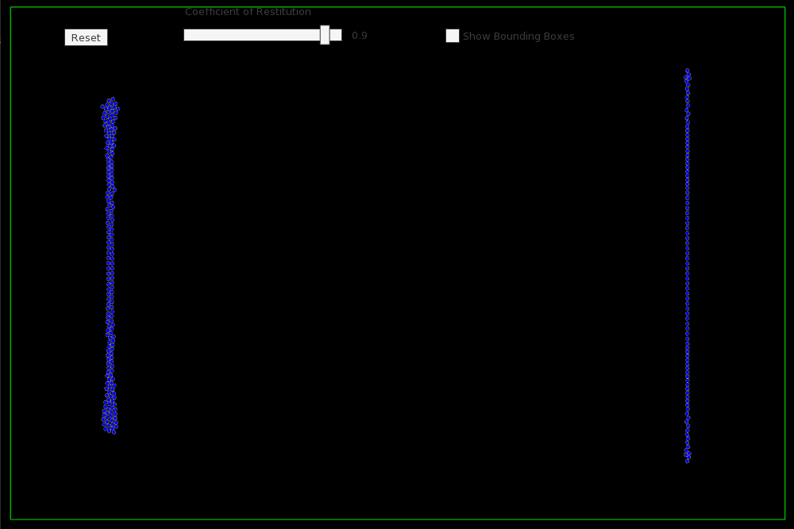

# PhysicsEngine2D
A simple implementation of a Physics Engine with collisions and force fields

# Prerequisites
* C++17.
* [LLVM](https://clang.llvm.org/) (Only needed for Windows and Linux, I guess :-)
* [Python3](http://python.org/)
	* [clang](https://pypi.org/project/clang/) Python clang binding
* [SFML](https://www.sfml-dev.org/) Minimum 2.5.1
* [TGUI](https://tgui.eu/) Minimum 0.8

